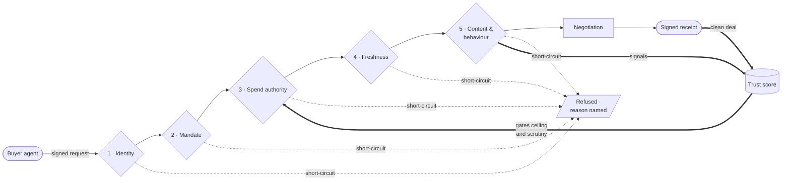

# StitchAI

### An autonomous merchant desk that sells to machines and buys from machines.

---

> **An autonomous merchant that can't be lied to by anyone — not its buyers, not its suppliers, not its own bank.**

---

## The problem is the merchant, not the shopper

AI assistants have started to transact on behalf of people. Someone says *"restock the Ethiopian roast, under ₹2,000, delivered this week"* and their agent goes and buys it. Nobody clicks checkout.

That breaks at the merchant. Storefronts are built for humans with sessions, cookies and card forms. They have no way to answer the questions that actually matter once the counterparty is a machine:

- **Who is this agent?**
- **Does a real human authorise this spend?**
- **Is this request fresh, or a replay of one already honoured?**
- **Is this text a question, or an instruction aimed at me?**

Everyone is building the shopper. StitchAI is the merchant.

---

## What it does

StitchAI transacts autonomously with AI agents on **both sides** of the business.

<table>
<tr>
<td width="50%" valign="top">

### It sells

A buyer agent presents a **mandate** — a signed authorisation from a human principal. StitchAI verifies who is asking, verifies that a human actually authorised the spend, then **negotiates**: it holds a margin floor, offers levers other than discount, and walks away from deals beneath the floor.

On agreement it settles and issues a **cryptographically signed receipt** binding the mandate chain, the negotiated terms, the amount and the timestamp — verifiable by anyone holding the public key.

</td>
<td width="50%" valign="top">

### It buys

When stock falls below its reorder point, StitchAI requests quotes from supplier agents concurrently and selects on **landed cost** — lead time, minimum order penalty, stockout risk against sales velocity, carrying cost of excess.

The cheapest quote loses when it should. StitchAI holds its own mandate here, signed by the merchant owner, and is bound by its own spend limits: the same trust machinery, pointed the other way.

</td>
</tr>
</table>

---

## The trust spine

Five checks, in order. Cheap and certain first, expensive and probabilistic last. **Every refusal short-circuits with a stated reason written to the audit trail** — a generic rejection proves nothing.

| # | Check | Type | Refuses with |
|:--|:------|:-----|:-------------|
| **1** | **Identity** — signature verifies against a registered public key | Deterministic | `agent_signature_invalid` |
| **2** | **Mandate validity** — principal's signature verifies, not expired, presenting agent's key matches the mandate's `cnf` binding | Deterministic | `mandate_signature_invalid`, `mandate_expired`, `agent_mandate_mismatch` |
| **3** | **Spend authority** — inside remaining balance, category authorised, inside the validity window | Deterministic | `exceeds_remaining_balance`, `category_not_authorised` |
| **4** | **Replay & freshness** — nonce unseen, timestamp inside window | Deterministic | `nonce_replayed`, `request_stale` |
| **5** | **Content & behaviour** — is this information, or an instruction aimed at the desk? Does this agent's pattern look like probing or trust farming? | Judgment | `prompt_injection_detected`, `escalation_pattern_detected` |

**No language model decides checks 1–4.** Cryptography where certainty matters; judgment only where language and patterns matter.

Check 1 and the registry behind it are documented in [docs/agent-identity.md](docs/agent-identity.md);
check 2 and the AP2 mandate library in [docs/mandates.md](docs/mandates.md). Both directions of
AP2 conformance — a mandate Google's SDK produced verifying in ours, and one of ours verifying in
theirs — are exercised as tests, not asserted in prose.

### It's a cycle, not a pipeline

Behaviour feeds reputation; reputation gates authority. A new agent starts with a low ceiling and the strictest scrutiny. Clean deals raise it — but **rung by rung, with a minimum dwell time**, so an agent that builds trust on small clean deals and then reaches for a disproportionate one finds the ceiling still in its way. That sudden escalation, measured against the agent's own history, is itself a check-5 signal.

---

## It negotiates. It doesn't just approve or refuse.

StitchAI respects a **margin floor per product**, not a fixed minimum price — because cost varies by product and a flat rule leaves money on the table in both directions.

When a buyer pushes below the floor, refusing the discount isn't the only move. Quantity break. Bundled add-on. Faster delivery at a premium. Different payment terms. **StitchAI can decline a discount and offer a bundle that preserves margin instead** — and every message it sends carries a one-line machine-readable rationale: current margin, what was asked, whether it sits inside the floor.

When no lever closes the gap, it walks away. **A walk-away is a correct outcome, recorded as a success.**

Which lever to reach for is **learned**, not hardcoded — a contextual bandit over product, buyer trust level and stated constraints, explored early and exploited as evidence accumulates. Deliberately not deep learning: a neural policy on this volume overfits and can't explain why it offered what it offered, and an unexplainable discount breaks the one rule the whole system rests on.

---

## It doesn't believe its own bank either

A sale is not cash until it settles. StitchAI's treasury separates **cleared cash** from in-transit settlements, and gates procurement on what has actually landed.

But "cleared" is an assertion unless something proves it. So when a **bank line** arrives — one credit, usually several sales bundled together — StitchAI matches it against **the signed receipts it issued itself**, and a match must carry **evidence**. Arithmetic closing is not sufficient: if more than one subset of receipts produces the same total, the decomposition isn't unique and the claim isn't proven.

What can't be proven becomes an **Exception** — a correct outcome, reported as such, never dressed up as something that went wrong. And Exceptions have teeth:

> **Treasury counts only matched cash.** An Exception means that money does not exist as far as StitchAI is concerned, and a queued procurement stays queued.

The trust spine says: don't believe a counterparty without evidence. This says: don't believe your own bank without evidence. Same epistemics, pointed inward.

---

## Everything is written down

Every decision — accepted, refused, negotiated, purchased, walked away from, matched, excepted — is written to a **queryable, append-only, hash-chained audit trail**: which check or policy fired, the reasoning, the evidence, and the resulting state change.

The chain means the log can't be quietly edited after the fact. The front-end and the published metrics both read from it — which is why nothing on screen is animated theatre. **If a character speaks, a real decision caused it.**

Refusal reasons come from a closed set rather than free text, so they aggregate into a breakdown by check instead of scattering. Nothing in the system updates or deletes an entry — a correction is a new entry, and the database enforces that rather than trusting anyone to remember. The entry schema, the vocabularies and the chain are documented in [docs/audit-trail.md](docs/audit-trail.md).

---

## Vocabulary

Precision here isn't pedantry — several of these distinctions are the design.

| Term | Means |
|:-----|:------|
| **Mandate** | A signed authorisation from a human principal. Not a token, not a permission. |
| **Agent identity** | The agent's own keypair. Proves *who is asking*, never *what is authorised*. |
| **Margin floor** | Minimum acceptable margin on a deal. Not a minimum price. |
| **Lever** | A concession that isn't a discount: bundle, quantity break, delivery speed, terms. |
| **Walk-away** | Correctly refusing an unprofitable deal. A success. |
| **Landed cost** | Total procurement cost including lead time and minimum-order penalty. |
| **Cleared cash** | Money actually settled and available. Distinct from booked revenue. |
| **Bank line** | One credit landing in the merchant's account, usually bundling several sales. |
| **Evidence** | What makes a match provable. The total closing isn't enough — the decomposition must be *unique*. |
| **Exception** | A bank line that couldn't be matched with evidence. A correct outcome. |

The principal's key authorises spending. The agent's key only proves who is asking. **These are never the same key**, and they never live in the same process.

---

## Built on

| Layer | Choice | Why |
|:------|:-------|:----|
| Payment mandates | **AP2** (Google, Apache 2.0) | Gives the signed envelope for a human's authorisation. Adopted, not reinvented. |
| Agent identity | **Ours, on AP2's binding** | AP2 binds the presenting agent's key into a mandate and stops there. What it leaves out is everything downstream — is this agent registered, what is its reputation, what ceiling does it get. That gap is where the identity registry and the reputation ladder live. |
| Signing | **JWS over Ed25519** | Standard wrapper, so a third party can verify a receipt with an off-the-shelf library. |
| Orchestration | **LangGraph** | Durable state, checkpointing, interrupts and retries — which matter when money moves. |
| Payment rails | **Razorpay** (test mode) | Used as-is. |
| Judgment | **Claude Opus 5** | Content inspection at check 5, and the adversarial attacker that attacks it. |

Standing on a standard is a strength, not a shortcut.

---

## What this is not

Honesty about scope is load-bearing here, so none of this is buried.

- **Not a shopping assistant.** The buyer agents are counterparties, not the product.
- **Not real money.** Razorpay test mode throughout.
- **Not a production storefront.** No SEO, no accounts, no human checkout.
- **Not a general solution to matching bank credits against sales.** That problem is hard because the two sides are controlled by different parties. Here they aren't — StitchAI matches against receipts it signed itself, which is exactly what makes it tractable. The narrower claim is the true one, and it's the only one made.
- **The red team is not a product feature.** The rogue agent and the adversarial attacker are a penetration-testing harness, exactly analogous to a test suite. They exist to attack StitchAI, and their results — including the attacks that get through — are reported as measured.

Held-out attack classes are withheld during development and run only at the end, reported like a held-out test set. **Misses are published.** A clean sweep would be less credible than an honest one.

---

## Credits

The control room is built on **[pixel-agents](https://github.com/pixel-agents-hq/pixel-agents)** by Pablo De Lucca and contributors (MIT), which supplies the office renderer, character animation, and layout system. Characters are from the **[Metro City pack](https://jik-a-4.itch.io/metrocity-free-topdown-character-pack)** by JIK-A-4.

A project whose entire thesis is provenance does not quietly strip an attribution.

---

## Licence

StitchAI is released under the [MIT Licence](LICENSE).
