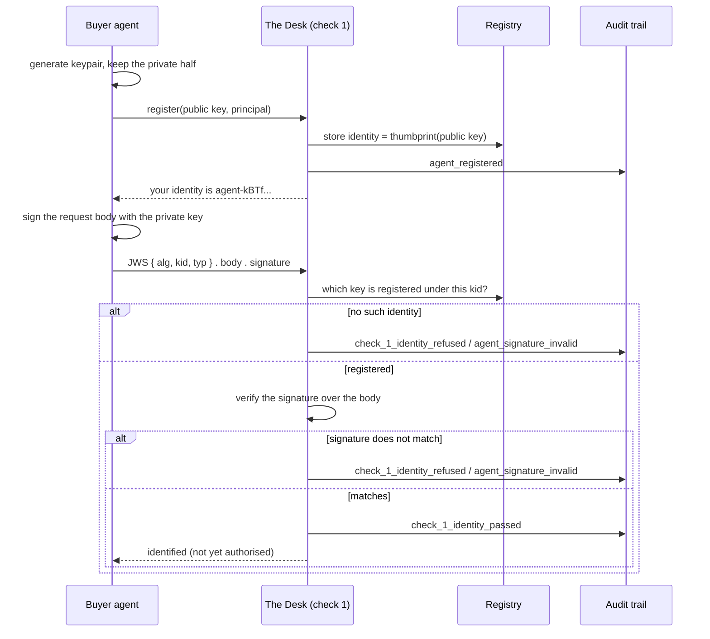

# Ticket 02 — Agent registration and identity (check 1)

**What shipped:** an AI buyer agent can introduce itself to the Desk once, and every
message it sends afterwards can be proven to have come from it, unaltered.

This document is layered. Section 1 assumes nothing at all; each section adds a little
more. Stop wherever you have what you need — the code is at the end, not the start.

| | |
|:---|:---|
| **Issue** | [#19](https://github.com/derrickrajkumar10/autonomous-merchant-desk/issues/19), under spec [#3](https://github.com/derrickrajkumar10/autonomous-merchant-desk/issues/3) |
| **Branch** | `ticket-02-agent-identity` |
| **Builds on** | Ticket 01, the audit trail |
| **Contract doc** | [docs/agent-identity.md](../agent-identity.md) — the terse version, for someone writing code against it |

---

## 1. The situation, with no jargon

Someone says to their AI assistant: *"restock my coffee, keep it under ₹2,000."* The
assistant goes off and buys it. Nobody clicks a checkout button.

Now look at it from the shop's side — which is what we are building. A program the shop
has never seen before sends it a message saying *"I'd like 2kg of coffee, and I'm
authorised to spend up to ₹2,000."*

Before the shop can think about price, stock or anything else, it has to answer the
cheapest question there is:

> **Who is asking?**

That is this ticket. Not "is this allowed" — just "is this who it says it is".

### The one distinction that matters

Two questions get muddled constantly, and keeping them apart is most of the point:

| Question | Everyday equivalent | Who answers it |
|:---|:---|:---|
| Who are you? | Showing your face at the door | **This ticket** |
| Are you allowed to spend this money? | Being handed the company card | Tickets 03 and 04 |

An ID card is not a credit card. Someone can be *definitely* who they say they are and
still have no authority to spend a rupee. In our code that distinction has a slogan,
and it is repeated in the docstrings on purpose:

> The principal's key authorises spending; the agent's key only proves who is asking.

("Principal" is our word for the human whose money it is. The assistant acting for them
is the "buyer agent". The shop is "the Desk".)

---

## 2. What we built, in plain words

Three things.

**1. A way to introduce yourself, once.** The agent makes itself a secret and a matching
public label. It keeps the secret forever and gives us the public label, along with the
name of the human it acts for. We give it back a name of its own. That is *registration*.

**2. A way to prove every later message is really from you.** The agent marks each
message with its secret. Anyone holding the public label can check the mark. The mark
also covers the message contents, so if a single character changes on the way to us, the
mark stops matching.

**3. A checker that says yes or no, and writes down why.** That is *check 1*, the first
of the five checks the Desk runs on every request. It either identifies the sender or
refuses, and either way an entry goes into the permanent record we built in ticket 01.

Everything else in this document is those three things in more detail.

---

## 3. Building up the ideas

### 3.1 Keys: a wax seal, not a password

A password is a **shared** secret. You know it, the shop knows it, and that is the
problem: two parties know it, so either can pretend to be you, and anyone who overhears
it can too.

A **keypair** splits the secret in half:

- a **private key** the agent generates and never shows anyone, and
- a **public key** it hands out freely.

The private key can make a mark that only it can make. The public key lets *anybody*
check that mark. Crucially, having the public key does not let you make the mark — you
can verify, never forge. So handing us the public key gives away nothing.

Think of a signet ring pressing wax. The ring is private; the pattern is public. Anyone
who has seen the pattern can recognise a genuine seal, and none of them can produce one.

**Ed25519** is simply the specific recipe we use for that ring — a modern one, fast,
small keys (32 bytes), and, most importantly for us, implemented in every language.
That last part matters because one of the project's goals is that a stranger can write
their own buyer agent in whatever language they like and talk to us.

### 3.2 A signature covers a *message*, not a person

This trips people up. A signature isn't a badge attached to the sender; it is computed
from **the exact bytes of the message**. So one check answers two questions at once:

- Did this come from the holder of that private key?
- Did anything change since they signed it?

Change `"quantity": 2` to `"quantity": 200` in transit and the signature no longer
matches. The Desk doesn't need to *notice* the edit — the maths simply stops working.

### 3.3 JWS: the standard envelope

We did not invent a message format. We use **JWS** — JSON Web Signature — which is the
standard way to wrap "here is some JSON, and here is a signature over it".

A JWS in compact form is three chunks joined by dots:

```
eyJhbGciOiJFZERTQSIsImtpZCI6ImFnZW50LWtCVGZ...   ← header    (what this is)
eyJxdWFudGl0eSI6Miwic2t1IjoiQ09GRkVFLTFLRyJ9     ← payload   (the request itself)
3n4Kx1_9pKq...                                   ← signature (the wax seal)
```

Each chunk is base64url — a way of writing bytes using only characters that survive
URLs and headers. It is **encoding, not encryption**: anyone can decode and read it.
Nothing here is secret. The signature is what makes it trustworthy, not hidden.

Our header carries exactly three things:

| Field | Value | Meaning |
|:---|:---|:---|
| `alg` | `EdDSA` | which signing recipe was used |
| `kid` | `agent-kBTfm6G0Pfs…` | which identity this claims to be from |
| `typ` | `stitchai-request+jws` | what kind of document this is |

`kid` is a *claim*, not proof. It only tells the Desk which public key to fetch and
check against. The signature does all the deciding.

Two smaller design points, both deliberate:

- **The request body lives inside the signature.** There is no envelope around it
  carrying extra fields, because anything outside the signature would be unsigned, and
  unsigned data next to signed data is how systems get fooled.
- **`typ` is inside the signed header.** A signature over a receipt is not a signature
  over a request. Without `typ`, someone could take a validly signed document of one
  kind and replay it where a different kind was expected. Signing *what it is* closes
  that.

### 3.4 The identity is computed from the key

When the agent registers, we have to give it a name. Two options:

1. Invent a random one and store it next to the key, or
2. Compute one *from* the key.

We compute it. Run the public key through a standard fingerprinting procedure
(SHA-256 over a canonical form of the key — RFC 7638 calls this a "thumbprint") and you
get a short unique string:

```
agent-kBTfm6G0Pfs-OYPZ8DGWAWULjSTVGhpcqBEKxkme_-I
```

That buys three things a random name would not:

- **One key is one identity, permanently.** With random names, the same key could
  register twice and collect two separate reputations. Since reputation gates how much
  an agent may spend later, that is trust-farming for free, with no attack required.
  Deriving the name makes it *impossible*, not merely *against the rules*.
- **Registering twice is harmless.** A restarted agent registers again and gets back the
  identity it already had. No "have I registered before?" bookkeeping on its side.
- **Anyone can check the link.** Given the public key, a stranger can recompute the
  identity themselves and confirm it matches. They never have to take our word for it.

The cost, which is real: **you cannot rotate your key and keep your history.** A new key
is a new agent starting from zero. For a system where the history *is* the reputation,
that is the right default, and it is written down in
[ADR-0011](../adr/0011-agent-identity-is-the-key-thumbprint.md).

### 3.5 Registration deliberately gives you almost nothing

Registering does **not** make an agent trusted. A newly registered agent sits at the
bottom of the ladder with the smallest spending ceiling and the strictest scrutiny.

What it buys is *accountability*: from that point on, behaviour attaches to a key. You
cannot misbehave and come back as somebody else without starting over from zero.

This is enforced structurally, not by convention. The identity object has exactly four
fields — the identity, the public key, the principal, and when it arrived. There is no
"balance" or "trust score" field on it that could be misread as authority, and a test
asserts that field list so nobody can quietly add one.

### 3.6 Everything gets written down

Ticket 01 built the audit trail: an append-only, hash-chained table where every decision
the Desk makes is recorded with its reasoning and its evidence. Nothing is ever edited
or deleted; a correction is a new entry.

This ticket writes to it at every outcome:

| What happened | Recorded as |
|:---|:---|
| An agent registered | `agent_registered` |
| A request was identified | `check_1_identity_passed` |
| A request was refused | `check_1_identity_refused`, reason `agent_signature_invalid` |
| A registered key tried to change its principal | `agent_registration_refused`, reason `agent_principal_mismatch` |

Refusal reasons come from a **fixed list**, not free text, so they add up into a
statistic ("how many refusals at check 1 this week?") instead of scattering into a
thousand slightly different sentences.

---

## 4. How a request actually flows



Check 1 in order, exactly as [desk/identity/check.py](../../desk/identity/check.py) does it:

1. **Read the header** without trusting it. If it isn't a readable JWS, refuse.
2. **Look up the `kid`** in the registry. Not registered? Refuse.
3. **Verify the signature** against that registered public key, insisting on `EdDSA`
   and on `typ` being a request. Anything off? Refuse.
4. **Return the body** the signature actually covered — and record that the request is
   `identified`, which is pointedly not `authorised`.

---

## 5. Why every refusal says the same thing

Six different things can go wrong, and all six come back as one reason code,
`agent_signature_invalid`:

- the key isn't registered
- the signature doesn't verify
- the body was altered after signing
- it was signed by a *different* registered agent
- it names an algorithm other than `EdDSA`
- it isn't a readable JWS at all

From the outside they are one answer: *that signature does not belong to a registered
agent.* Telling a prober which half of its lie was believed would tell it exactly where
to push next.

On the inside they are told apart in full, because the audit trail is a reader we trust:

```json
{
  "check": 1,
  "reasoning": "no agent is registered under the key this request claims to be signed by",
  "evidence": { "claimed_agent_id": "agent-kBTf...", "algorithm": "EdDSA" },
  "state_change": { "request": "refused" }
}
```

That gap — vague outside, precise inside — is a security property, not an accident.

---

## 6. The code

| File | What it is |
|:---|:---|
| [desk/identity/keys.py](../../desk/identity/keys.py) | `AgentPublicKey` and `PrincipalPublicKey`, plus the thumbprint |
| [desk/identity/jws.py](../../desk/identity/jws.py) | the wire format, and reading/verifying a request |
| [desk/identity/schema.py](../../desk/identity/schema.py) | the registry table (five columns, no private keys) |
| [desk/identity/registry.py](../../desk/identity/registry.py) | registering and looking up agents |
| [desk/identity/check.py](../../desk/identity/check.py) | check 1 itself |
| [world/agents/keys.py](../../world/agents/keys.py) | the **agent's** side: generating a keypair and signing |

Why is the last one in `world/` and not `desk/`? Because the repo separates the *product*
(`desk/` — the merchant, everything we are defending) from the *environment* (`world/` —
the counterparties). A buyer agent is a counterparty. Concretely: the private key must
never live somewhere `desk/` could reach it, and the folder boundary makes that visible.

Two types, not one, for keys:

```python
class AgentPublicKey(_Ed25519PublicKey):      # proves who is asking
class PrincipalPublicKey(_Ed25519PublicKey):  # authorises spending
```

They hold identical bytes and are deliberately **not** interchangeable. Passing a
principal's key where an agent's key belongs is an error your editor catches, and a
`TypeError` at runtime if it somehow gets that far. That is the section-1 distinction
made structural, so it cannot be eroded by a careless line of code two months from now.

### Using it

```python
# The agent's side
keypair = AgentKeypair.generate()
identity = registry.register(public_key=keypair.public_key, principal_id="principal-asha")
request = keypair.sign_request({"sku": "COFFEE-1KG", "quantity": 2}, agent_id=identity.agent_id)

# The Desk's side
outcome = IdentityCheck(registry, trail).verify(request)
if outcome.passed:
    outcome.identity   # the registered agent
    outcome.body       # what the signature actually covered
```

`outcome.body` only exists after the check passes. Before that there is nothing but
unverified bytes, and the type system says so (`dict | None`) rather than trusting you
to remember.

---

## 7. Decisions worth knowing, and what each cost

| Decision | Why | What it costs |
|:---|:---|:---|
| Identity = key thumbprint | one key ↔ one identity; anyone can check it | no key rotation without losing history |
| PyJWT does the signing, not us | never hand-roll a standard; strangers can interoperate | a dependency |
| Two key types | the identity/authority split can't erode | a little duplication |
| `typ` inside the header | a receipt can't be replayed as a request | one more thing to get right |
| One reason code outward | a prober learns nothing from probing | you must read the trail to debug |
| Row + trail entry in one transaction | the trail can never disagree with reality | the trail needed a new parameter |

That last one was a small change to ticket 01's code: `AuditTrail.record()` now accepts
a database connection, so a state change and the record of it commit together or not at
all. Without it, a crash at the wrong instant could leave a registered agent whose
arrival the trail never saw — and a trail that disagrees with reality is worse than no
trail.

---

## 8. What this ticket deliberately does *not* do

This is the part reviewers care about most, because a check that quietly does more than
it claims is worse than one that does less.

| Not this | Whose job |
|:---|:---|
| Is a human actually authorising this spend? | Check 2 — mandates (ticket 03) |
| Is the amount within what was authorised? | Check 3 — spend authority (ticket 04) |
| Have I already honoured this exact request? | Check 4 — replay and freshness (ticket 05) |
| Is this text an *instruction* aimed at me? | Check 5 — the Inspector (ticket 10) |
| Receipts the Desk signs itself | Ticket 09 |
| Key rotation, revocation, sessions | Deliberately out of scope for this build |

A signed request replayed a second time passes check 1 exactly as it did the first time.
That is not a bug in check 1; it is check 4's entire reason for existing.

---

## 9. Seeing it for yourself

```bash
uv sync --extra dev
.venv/Scripts/python.exe -m pytest tests/identity -q     # 27 tests, no setup needed
```

The tests spin up a real throwaway Postgres by themselves. They are also the best
worked examples in the repo: [tests/identity/test_check_one.py](../../tests/identity/test_check_one.py)
is essentially a list of ways to lie to the Desk, each with the refusal it earns.

This snippet needs no database — paste it into `python`:

```python
import json
from jwt.utils import base64url_encode
from desk.identity import read_header, verify_request
from world.agents.keys import AgentKeypair

keypair = AgentKeypair.generate()
agent_id = keypair.public_key.agent_id

request = keypair.sign_request({"sku": "COFFEE-1KG", "quantity": 2}, agent_id=agent_id)
print(read_header(request))                          # alg, kid, typ
print(verify_request(request, keypair.public_key))   # {'quantity': 2, 'sku': 'COFFEE-1KG'}

# Now be greedy: same header, same signature, bigger order.
header, _, signature = request.split(".")
greedier = json.dumps({"sku": "COFFEE-1KG", "quantity": 200}).encode()
altered = f"{header}.{base64url_encode(greedier).decode()}.{signature}"

try:
    verify_request(altered, keypair.public_key)
except ValueError as refused:
    print("refused:", refused)
```

The last line prints *the signature does not verify against the registered public key*.
That one line is the whole ticket in miniature.

---

## 10. Glossary

| Term | Means |
|:---|:---|
| **The Desk** | Our system — the merchant. What we are building and defending. |
| **Buyer agent** | An AI program trying to buy from us. Untrusted, always. |
| **Principal** | The human whose money it is, on whose behalf an agent acts. |
| **Agent identity** | The agent's registered keypair. Proves *who is asking*, never *what is authorised*. |
| **Keypair** | A private half that signs and a public half that verifies. |
| **Ed25519** | The specific signature scheme we use. Fast, small, everywhere. |
| **JWS** | JSON Web Signature — the standard envelope: `header.payload.signature`. |
| **base64url** | A way of writing bytes as safe text. Encoding, not encryption. |
| **`kid`** | "Key ID" — which identity a message *claims* to be from. |
| **Thumbprint** | A standard fingerprint of a public key (RFC 7638). Our identities are these. |
| **Audit trail** | The append-only, hash-chained record of every decision (ticket 01). |
| **Reason code** | A refusal reason from a fixed list, so refusals aggregate into metrics. |
| **Check 1–5** | The trust spine, cheapest and most certain first. This ticket is check 1. |

---

## 11. Next

**Ticket 03 — mandates and check 2.** Now that the Desk knows *who* is asking, the next
question is whether a human actually authorised the spend. That is a document signed by
the principal's key, carrying the agent's public key inside it — which is what makes a
stolen authorisation useless to anybody but the agent it was issued to.

Notice the shape of that: check 2 is only meaningful because check 1 exists. Each rung
of the spine stands on the one below it.
